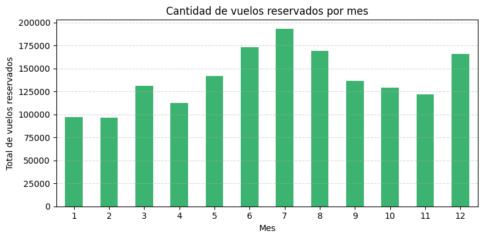
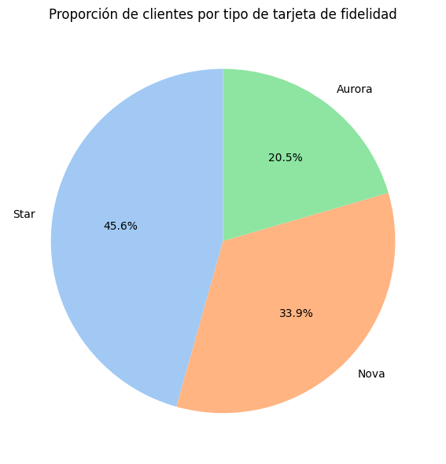
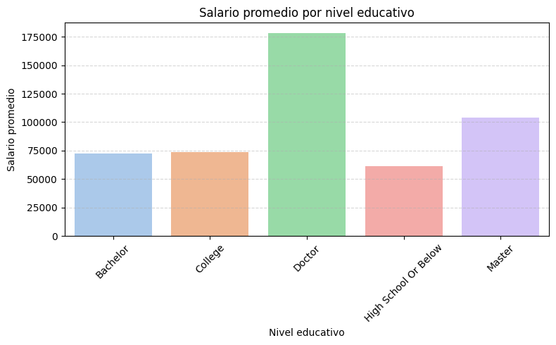

## ✈️ Análisis de Clientes de Aerolínea - Proyecto Final Módulo 3

¡Bienvenida/o a mi proyecto de evaluación final del Módulo 3!  
En este análisis trabajo con datos reales de una aerolínea para entender el comportamiento y perfil de sus clientes.  
El objetivo es ofrecer conclusiones claras y visuales que ayuden a **mejorar la fidelización y segmentación**.

---

## 🎯 Objetivo del proyecto

- Explorar los datos de clientes y su actividad aérea.
- Detectar patrones y relaciones entre variables clave.
- Generar visualizaciones útiles para la **toma de decisiones empresariales**.
- Comunicar hallazgos de forma clara, profesional y visual.

---

## 🗂️ Dataset utilizado

Se han combinado dos fuentes de datos:

1. `Customer Flight Activity.csv` → Información mensual sobre vuelos, puntos, distancia, etc.
2. `Customer Loyalty History.csv` → Datos demográficos y de fidelización (educación, salario, tarjeta, etc.)

---

## 🛠️ Proceso de trabajo

### 🔍 Exploración inicial
- Revisión de estructura, duplicados y valores nulos.
- Análisis estadístico básico (`.describe()`, `.info()`).
- Validación de tipos de datos.

### 🧹 Limpieza de datos
- Eliminación de duplicados por cliente y mes.
- Corrección de salarios negativos mediante valores absolutos.
- Creación de una nueva variable `active_customer` para indicar si el cliente sigue activo.
- Mantenimiento de valores nulos en cancelaciones por coherencia analítica.

### 🔗 Unión de datasets
- Merge entre ambas tablas mediante `Loyalty Number`.
- Se priorizó mantener todos los registros de actividad de vuelo (`left join`).

---

## 📊 Visualizaciones clave

### 📈 Vuelos por mes
Los vuelos aumentan en verano y diciembre, mostrando estacionalidad clara.

---

### 📍 Distribución de tarjetas de fidelidad

La mayoría de los clientes tienen tarjeta **Star** o **Nova**, siendo las más populares.

---

### 📚 Salario por nivel educativo
Existe una clara correlación: **mayor educación, mayor salario promedio**.

---

## 🧠 Conclusiones destacadas

- La mayoría de los clientes son **casados**, y el género no influye significativamente en su estado civil.
- Los clientes con **Doctorado y Máster** tienen los salarios más altos.
- La **tarjeta Star** es la más usada → buena candidata para promociones exclusivas.
- La **actividad aérea muestra picos en verano y diciembre**, lo que permite diseñar campañas estacionales.
- La mayoría de clientes sigue **activa**, lo que indica una buena retención.

---

## 📎 Informe completo del análisis

Si quieres ver el análisis completo, con todos los pasos, gráficos, explicaciones y decisiones técnicas, puedes consultarlo aquí:

👉 [Ver informe completo](Informe_analisis.md)

👉 [Ver notebook completo](Ejercicio_mod3.ipynb)

---

## 💻 Tecnologías usadas

- Python (Pandas, Matplotlib, Seaborn)
- Jupyter Notebook
- Git y GitHub

---

## ✨ Autor

👩‍💻 Isabel García – [@Isabel-GM](https://github.com/Isabel-GM)

Proyecto realizado para Adalab — Módulo 3: Análisis exploratorio y visualización de datos.

---

